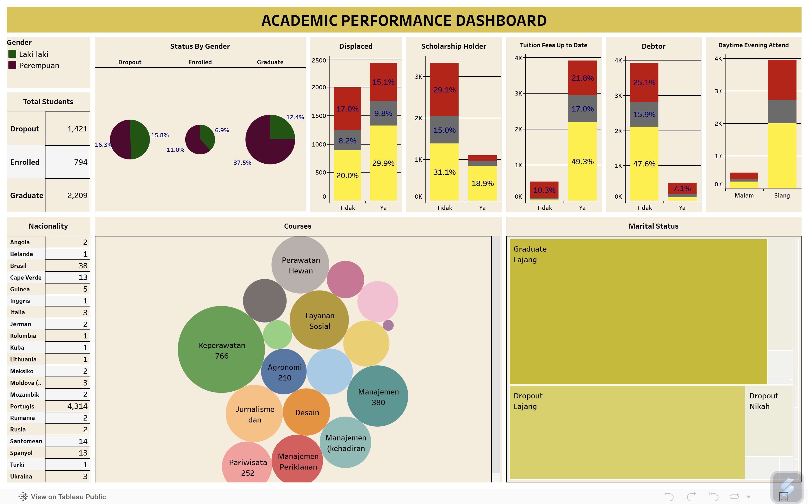

# Proyek Akhir: Menyelesaikan Permasalahan Perusahaan Edutech

## Business Understanding
Jaya Jaya Institut merupakan salah satu institusi pendidikan perguruan yang telah berdiri sejak tahun 2000. Hingga saat ini ia telah mencetak banyak lulusan dengan reputasi yang sangat baik. Akan tetapi, terdapat banyak juga siswa yang tidak menyelesaikan pendidikannya alias dropout.

Jumlah dropout yang tinggi ini tentunya menjadi salah satu masalah yang besar untuk sebuah institusi pendidikan. Oleh karena itu, Jaya Jaya Institut ingin mendeteksi secepat mungkin siswa yang mungkin akan melakukan dropout sehingga dapat diberi bimbingan khusus.

### Permasalahan Bisnis
Tingkat dropout mahasiswa yang tinggi menjadi tantangan utama bagi Jaya Jaya Institute. Fenomena ini menyebabkan kerugian finansial bagi institusi karena hilangnya pendapatan dari mahasiswa yang tidak melanjutkan studi, sekaligus berpotensi merusak reputasi. Bagi mahasiswa, dropout dapat menghambat peluang karier dan kesejahteraan mereka di masa depan.

### Cakupan Proyek
Proyek ini bertujuan untuk menganalisis data mahasiswa untuk menemukan faktor-faktor penyebab dropout. Hasil analisis ini akan divisualisasikan dalam sebuah business dashboard interaktif yang mudah dipahami. Selain itu, proyek ini juga akan mengembangkan model machine learning untuk memprediksi mahasiswa yang berisiko dropout. Prediksi ini akan diintegrasikan ke dalam dashboard sehingga Jaya Jaya Institut dapat mengambil tindakan pencegahan yang tepat waktu. Dengan demikian, diharapkan proyek ini dapat membantu Jaya Jaya Institut mengoptimalkan strategi intervensi dan meningkatkan angka kelulusan mahasiswa secara keseluruhan.

### Persiapan

Sumber data: [Jaya Jaya Institut](https://github.com/dicodingacademy/dicoding_dataset/blob/main/students_performance/data.csv)

Setup environment:
- Buat Virtual environment
```
python -m venv env
```
- Jalankan virtual environment
```
env\Scripts\activate
```
- Install library yang digunakan
```
pip install -r requirements.txt
```

## Business Dashboard
Dashboard Academic Performance memberikan gambaran menyeluruh tentang status mahasiswa, mencakup jumlah mahasiswa yang dropout, lulus, atau terdaftar. Analisis ini melibatkan faktor-faktor seperti penerima beasiswa, pembayaran biaya kuliah, status peminjam, dan mata kuliah yang diambil. Selain itu, dashboard ini juga menyajikan data demografis, termasuk kewarganegaraan mahasiswa, jenis kelamin, dan status pernikahan. Visualisasi ini membantu institusi untuk memahami lebih dalam tentang faktor-faktor yang memengaruhi kinerja akademik dan tingkat kelulusan mahasiswa, sehingga dapat merumuskan strategi yang lebih tepat dalam mengurangi angka dropout dan meningkatkan keberhasilan akademik.

Akses Academic Performance Dashboard: [Dashboard](https://public.tableau.com/app/profile/muhamad.alif.ramadhan/viz/AcademicPerformanceDashboard_17461113842420/Dashboard#1)



## Menjalankan Sistem Machine Learning
Untuk menjalankan prototype machine learning yang telah dibuat, ada dua cara akses yang tersedia, yaitu menjalankannya secara lokal atau melalui link Streamlit. Berikut adalah langkah-langkah yang perlu dilakukan jika ingin menjalankan prototype di lingkungan lokal:

1. Buka terminal pada _virtual environment_ yang telah dibuat sebelumnya.
2. Pastikan direktori saat ini menampung berkas-berkas yang telah diekstrak sebelumnya, terutama yang memiliki berkas **app.py**. Jika belum di direktori yang tepat, bisa menggunakan perintah di bawah

```
cd path/to/destination/directory
```

3. Setelah direktorinya sesuai, bisa menjalankan perintah di bawah

```
streamlit run app.py
```

4. Setelah berhasil dijalankan, masukkan data yang sesuai kemudian klik tombol **Predict** untuk mengetahui status siswa tersebut.
   
untuk mengaksesnya secara online, Anda dapat membukanya melalui tautan berikut: [Jaya Jaya Institute App](https://academic-performance-analysis.streamlit.app)

## Conclusion
Berdasarkan hasil analisis, dapat disimpulkan bahwa faktor-faktor seperti pembayaran uang sekolah, jumlah unit kurikuler yang disetujui, prestasi akademik, dan status penerima beasiswa memiliki dampak signifikan terhadap status mahasiswa, terutama dalam hal kemungkinan terjadinya dropout.

Hal ini sejalan dengan temuan yang terlihat dalam pie chart, di mana proporsi mahasiswa yang melakukan dropout cukup tinggi, yaitu mencapai 32,1%. Sementara itu, persentase mahasiswa yang lulus adalah 49,9%, dan mahasiswa yang masih terdaftar namun belum lulus sebesar 17,9%.

### Rekomendasi Action Items
Berikan beberapa rekomendasi action items yang harus dilakukan perusahaan guna menyelesaikan permasalahan atau mencapai target mereka.
- Pembaruan Sistem Pembayaran UKT Secara Berkala.
Lakukan update rutin terhadap data biaya UKT setiap semester untuk mencegah timbulnya masalah keuangan yang dapat menyebabkan mahasiswa berhenti studi. Institusi juga dapat menerapkan sistem notifikasi otomatis kepada mahasiswa dan orang tua untuk mengingatkan mengenai informasi terbaru terkait biaya kuliah.

- Pendampingan Akademik untuk Mahasiswa dengan Nilai Rendah.
Perhatikan secara khusus mahasiswa yang memperoleh nilai di bawah 13, baik di semester awal maupun semester lanjutan. Berikan dukungan seperti bimbingan belajar, sesi konsultasi dengan dosen pembimbing, serta kelas remedial untuk membantu mereka meningkatkan performa akademik.

- Skema Dukungan Keuangan yang Fleksibel.
Tawarkan opsi bantuan keuangan seperti cicilan biaya kuliah, perluasan program beasiswa, atau subsidi pendidikan bagi mahasiswa yang mengalami kendala finansial agar mereka tetap dapat melanjutkan pendidikan tanpa hambatan ekonomi.

- Program Peningkatan Kemampuan Belajar Mahasiswa.
Adakan pelatihan dan kegiatan seperti workshop belajar efektif, manajemen waktu, dan program mentoring untuk membantu mahasiswa meningkatkan kemampuan akademik sekaligus menjaga motivasi belajar mereka.

- Peningkatan Peran Dosen dalam Mendukung Mahasiswa.
Lakukan pelatihan bagi dosen agar mereka mampu mengenali tanda-tanda mahasiswa yang mengalami kesulitan akademik atau non-akademik, serta dapat memberikan dukungan yang tepat sejak dini guna mencegah potensi dropout.
